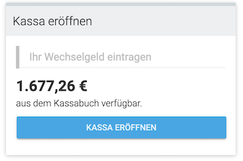
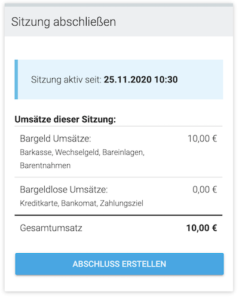

# Sessions

Before using the POS, the user has to **start a session**. It represents a timespan a user actively used the POS. At the end of this timespan, a session report will be created.

There can be only 1 active session of a pos.

## Start a new session

**API-ENDPOINT:** [POST /v2/sessions](https://onlinebon.docs.apiary.io/#reference/v2/sessions/start-a-session)

A user has to start a session to use the POS and start creating receipts. He has to option to transfer change funds from the cashbook into the cashdesk.
A user can only start a session if there is no other session active for this cashdesk.

## End current session

**API-ENDPOINT:** [PUT /v2/sessions/:id](https://onlinebon.docs.apiary.io/#reference/v2/sessions/end-a-session)

A user with an active session can end this session every time. When ending the session, a session report will be created which summarize the activity during the session. 

