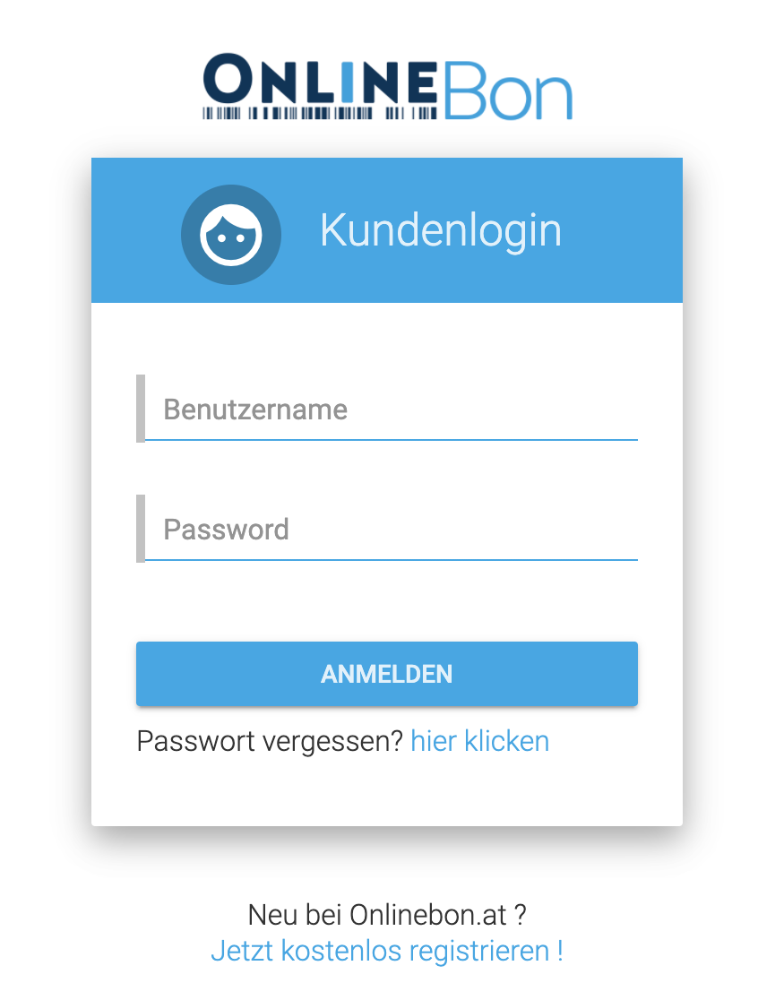

# Authentication & Authorisation

### Authenticate
To authenticate with OnlineBon you need to provide a **username** (email-address) and your private **password**.

After the authentication the following rules apply to decide, which actions the user has available:

- If the account of the user is still in TEST-Mode and the Trial-Period (30 days) is already passed due, the user will be redirected to the activation page 
- If the user has not accepted the latest policy version, the user will be forced to accept the latest version before he can continue using OnlineBon
- If the cashdesk the user is linked to is currently LOCKED, the user will be logged out instantly.
- If the account of the user is already activated more than 7 days, but the cashdesk is not registered at the autorities, the user will be redirected to the authority registration page

### Authorisation

There are 2 roles at OnlineBon with the following access-rights:

#### Owner
- the owner has access to all function of OnlineBon

#### Employee
- can access pos
- can create products
- can edit products
- can create productgroups
- can edit productgroups
- can create client
- can edit client
- can create receipts from type "Invoice", "Cancellation", "Cost-Estimation"
- can start a session
- can stop a session
