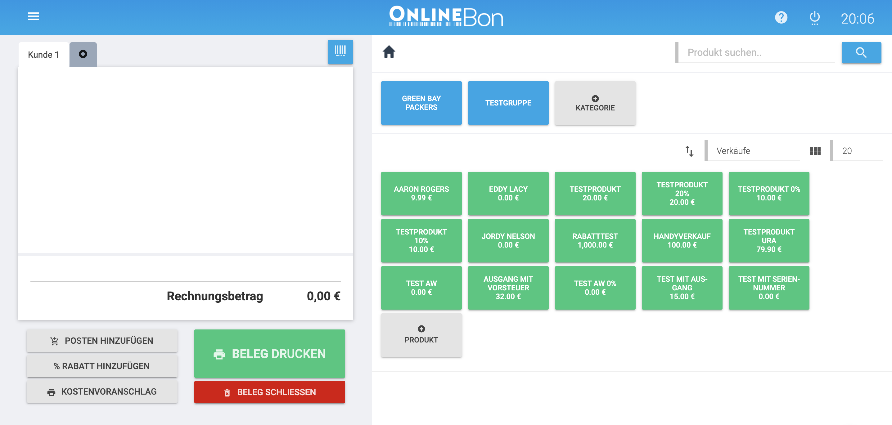
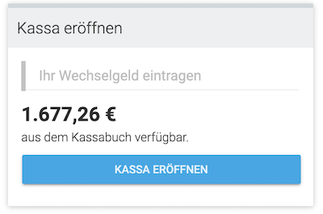
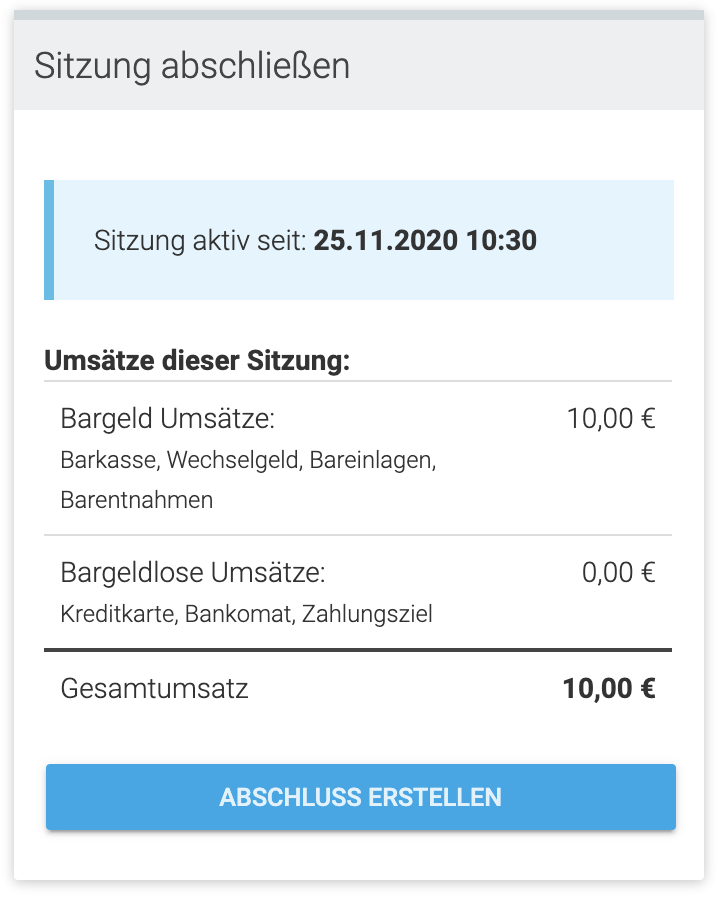

# POS

## Sessions

Before using the POS, the user has to start a session. It represents a timespan a user actively used the POS. At the end of this timespan, a session report will be created.

There can be only 1 active session of a pos.

### Start a new session

A user has to start a session to use the POS and start creating receipts. He has to option to transfer change funds from the cashbook into the cashdesk.

A user can only start a session if:

- there is no other session active for this cashdesk

### End current session

A user with an active session can end this session every time. When ending the session, a session report will be created which summarize the activity during the session. 

## Products
### List products & productgroups

### Create new productgroup

### Create new product

## Clients

### Search for a client

### create a new client

### edit a client

## Receipts

### Add receiptItem to receipt

### Edit a receiptItem
### Add a discount to a receiptItem

### Add a discount to a receipt

### Add a client to a receipt

### Persist a receipt

#### The following rules apply when persisting a receipt:
- the account of the user must be in one of the following status: TESTING, ACTIVATED or ACTIVATING
- the cashdesk has to be open (active session)
- the cashdesk of the account has to be started (start-receipt created)
- the overall value of the receipt could not bring the balance of the cashdesk into a negative state

### Cancel a receipt

### Print a receipt

### Send a receipt via email